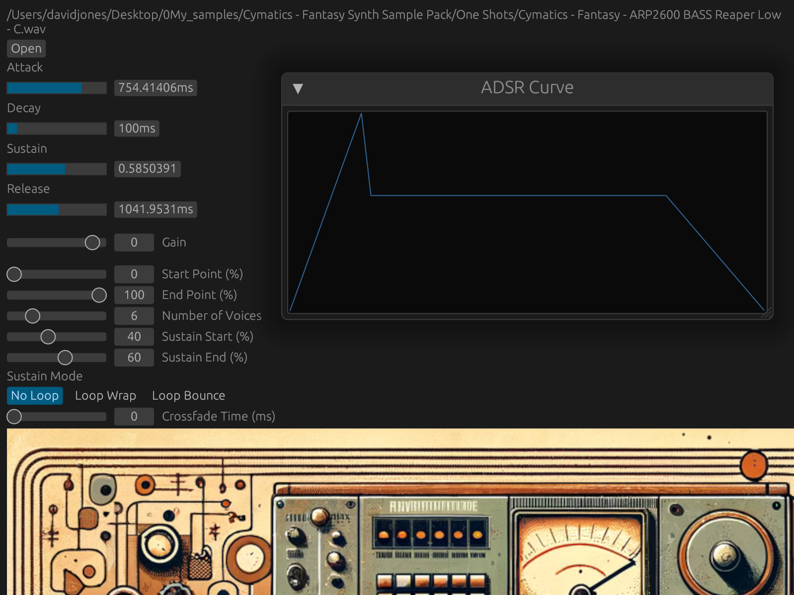

# SAE2024_Final

## Compilation Steps

### After installing Rust, you can compile Ase Example as follows:

1. First enter the directory in which this repository is cloned. For instance: 'cd Desktop/SAE2024_Final/'

2. Then enter the RustSampler directory using 'cd RustSampler' 
   * If you would like to have the image at the bottom of the GUI, you will have to change the file path near line 384 to the path of your clone/fork of this repository

3. then run 'cargo xtask bundle RustSampler --release'

4. Then, in the 'RustSampler/Target/bundled/' directory there will be a RustSampler.vst3 file and a RustSampler.clap file

5. Move the file of your desired plugin format to your system's plug-in directory. For instance on mac it might look like this: '/Library/Audio/Plug-Ins/VST3'

## GUI Image

